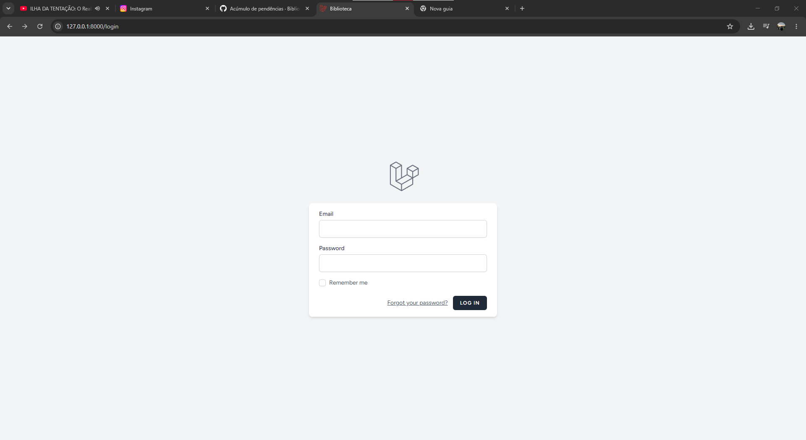
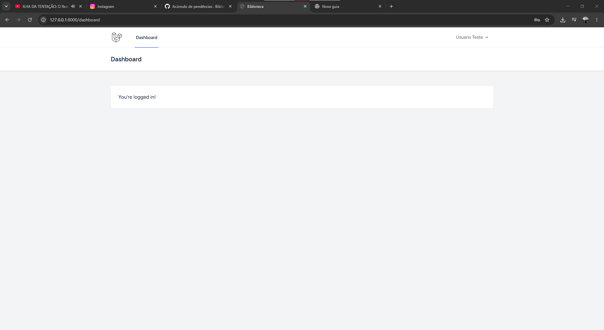

# Manual do Usuário — Sistema de Biblioteca

## 1. Login

O login é utilizado para que o usuário tenha acesso ao sistema.

### Como realizar o login

1. Acesse a página de login do sistema.
2. Informe seu e-mail.
3. Informe sua senha.
4. Clique no botão de login.
5. Se os dados estiverem corretos, o usuário será direcionado para o dashboard.php -v

